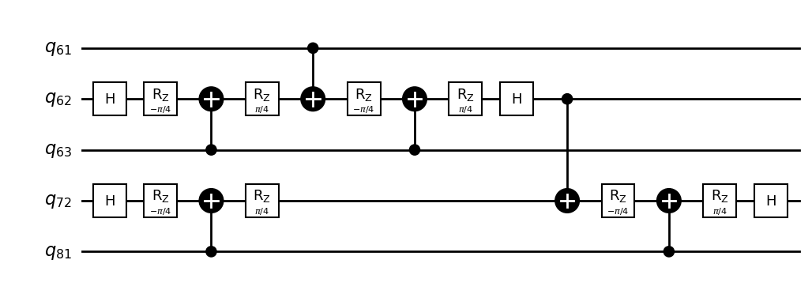

# CALA-*n* Quantum Library

[](https://github.com/albayaty/cala_quantum_library/actions/workflows/tests.yml)
[](https://jupyter.org)
[](https://www.python.org)
[](https://www.ibm.com/quantum/qiskit)
[](https://www.ibm.com/quantum/ecosystem)

[](https://www.apache.org/licenses/LICENSE-2.0)

CALA-*n* is a quantum library of **Clifford+T-based Architecture of Layout-Aware *n*-bit gates**. CALA-*n* quantum library is proposed for cost-effective quantum gates transpilation, based on the layouts and the number of *n* neighboring physical qubits for IBM quantum computers, where 2 <= *n* <= 5 qubits. All *n*-bit gates of CALA-*n* quantum library are constructed from Clifford+T gates as well as designed using the geometrical approach of the Bloch sphere, based on the visual representations of the rotational quantum operations for IBM single-qubit basis gates (X, √X, and RZ) and IBM double-qubit basis gate (CX or ECR). In other words, the Bloch sphere is utilized in the CALA-*n* quantum library as a **geometrical design tool**, through the utilization of the XY-plane (the top-view of the Bloch sphere) as illustrated below.

")

CALA-*n* quantum library has a set of cost-effective *n*-bit gates, including:

* **2-bit SWAP gate**
* **2-bit controlled-√X gate:** the controlled-V gate.
* **2-bit controlled-√X† gate:** the controlled-V† gate.
* **3-bit Boolean gates:** AND, NAND, OR, NOR, implication, and inhibition gates.
* **3-bit Fredkin gate:** the controlled-SWAP (CSWAP) gate.
* **3-bit Miller gate:** the quantum distance gate.

The cost-effectiveness of these *n*-bit gates of CALA-*n* quantum library comes from the following essential configurations as well as their symmetrical structures as demonstrated in the figure below (SP is a superposition gate {H, √X, or √X†}, and AX is an auxiliary gate for constructing various 3-bit gates of CALA-*n*):

1. All control qubits of an *n*-bit gate are only connected to the target qubit, without any mutual connection among them. For instance, all control qubits are connected to a target qubit using Feynman (CX) gates.
2. The target qubit of an *n*-bit gate can be replaced with any of the control qubits. For instance, the target qubit can be mapped in the middle among the control qubits, to fit the layout of an IBM quantum computer efficiently.
3. Based on (1) and (2), SWAP gates are no longer required to connect the non-neighboring physical qubits of an IBM quantum computer for the final transpiled *n*-bit gates.


Experimentally, from the above-mentioned essential configurations, the final transpiled quantum circuits constructed from *n*-bit gates of CALA-*n* quantum library always have lower quantum costs and fewer depths than those constructed from standard *n*-bit quantum gates, e.g., *n*-bit Toffoli and *n*-bit Fredkin gates, for IBM quantum computers.

The CALA-*n* is a derived quantum library from our GALA-*n* generic quantum library [[GitHub](https://github.com/albayaty/gala_quantum_library)], with the following distinctive features between them, where their utilized Clifford+T gates are: I, H, Z, T, T†, and CX.

| Features | GALA-*n* | CALA-*n* |
| :------- | :------: | :------: |
| *n* qubits | *n* >= 3 | 2 <= *n* <= 5 |
| Constructed from Clifford+T gates? | Yes | Yes |
| Constructed from non-Clifford+T gates? | Yes | No |
| Has symmetrical structures? | Yes | Yes |
| Has layout-aware architectures? | Yes | Yes |
| Suitable for IBM quantum layouts? | Yes | Yes |

For more information about the GALA-*n* quantum library and our introduced Bloch sphere approach, please read our paper entitled **"GALA-*n*: Generic Architecture of Layout-Aware *n*-Bit Quantum Operators for Cost-Effective Realization on IBM Quantum Computers"**, available at https://doi.org/10.48550/arXiv.2311.06760

For more information about the CALA-*n* quantum library and our developed Bloch sphere approach, please read our paper entitled **"CALA-*n*: A Quantum Library for Realizing Cost-Effective 2-, 3-, 4-, and 5-bit Gates on IBM Quantum Computers using Bloch Sphere Approach, Clifford+T Gates, and Layouts"**, available at https://doi.org/10.48550/arXiv.2408.01025

## Installation

Install the latest version of the CALA-*n* quantum library using the `pip` command:

```bash
pip install git+https://github.com/albayaty/cala_quantum_library@main
```

Instead, the CALA-*n* quantum library can be manually installed as stated in the following steps:

1. Download this repository to your computer, as a ZIP file.
2. Extract this file to a folder, e.g., `cala_quantum_library`.
3. Use the `terminal` (or the `Command Prompt`) to `cd` to the `cala_quantum_library` folder.
4. Install the `setup.py` file using the following command:

   ```bash
    python setup.py install
    ```
    Or, using this command:

    ```bash
    python3 -m pip install .
    ```

## Usage

First of all, please be sure that the following prerequisite packages have been installed:

- [X] `qiskit` (version >= 1.0).
- [X] `qiskit_aer` (simulating quantum circuits locally).
- [X] `qiskit_ibm_runtime` (transpiling and executing quantum circuits on IBM quantum computers).
- [X] `qiskit.visualization` (plotting histograms, distributions, etc.).
- [X] `numpy` (mathematical constants and calculations).
- [X] `matplotlib` (drawing quantum circuits).

Next, the CALA-*n* quantum library consists of five callable functions as follows.

1. **2-bit SWAP gate:**

    ```python
    CALA_SWAP(as_block=False, statistics=False)
    ```

    Where,

    `as_block`: construct a gate as a quantum circuit or a block, its default value is `False`, and

    `statistics`: print the final counts of H, RZ, and CX gates, as a final quantum cost.
    
    The `CALA_SWAP` function returns the 2-bit SWAP gate of CALA-*n* as a quantum circuit or a block. Note that this gate has 2 target qubits.

2. **2-bit controlled-√X and controlled-√X† gates:**

    ```python
    CALA_CSX(gate="CSX", as_block=False, statistics=False)
    ```

    Where,

    `gate`: the name of a 2-bit controlled gate: `"CSX"` for the 2-bit controlled-√X (controlled-V) gate as a default, or `"CSXdg"` for the 2-bit controlled-√X† (controlled-V†) gate,
    
    `as_block`: construct a gate as a quantum circuit or a block, its default value is `False`, and

    `statistics`: print the final counts of H, RZ, and CX gates, as a final quantum cost.
    
    The `CALA_CSX` function returns the 2-bit controlled gate of CALA-*n* as a quantum circuit or a block. Note that the target qubit is the last indexed qubit.

3. **3-bit Boolean gates:**

    ```python
    CALA_Boolean(gate="AND", as_block=False, statistics=False)
    ```

    Where,

    `gate`: the name of a 3-bit Boolean gate: `"AND"` as the default gate, `"NAND"`, `"OR"`, `"NOR"`, `"IMP"` as the implication, or `"INH"` as the inhibition,
    
    `as_block`: construct a gate as a quantum circuit or a block, its default value is `False`, and

    `statistics`: print the final counts of H, RZ, and CX gates, as a final quantum cost.
    
    The `CALA_Boolean` function returns the 3-bit Boolean gate of CALA-*n* as a quantum circuit or a block. Note that the target qubit is the last indexed qubit.

4. **3-bit Fredkin gates:**

    ```python
    CALA_Fredkin(as_block=False, statistics=False)
    ```

    Where,

    `as_block`: construct a gate as a quantum circuit or a block, its default value is `False`, and

    `statistics`: print the final counts of H, RZ, and CX gates, as a final quantum cost.
    
    The `CALA_Fredkin` function returns the 3-bit Fredkin gate of CALA-*n* as a quantum circuit or a block. Note that the target qubits are the last two indexed qubits.

5. **3-bit Miller gates:**

    ```python
    CALA_Miller(as_block=False, statistics=False)
    ```

    Where,

    `as_block`: construct a gate as a quantum circuit or a block, its default value is `False`, and

    `statistics`: print the final counts of H, RZ, and CX gates, as a final quantum cost.
    
    The `CALA_Miller` function returns the 3-bit Miller gate of CALA-*n* as a quantum circuit or a block. Note that this gate has 3 output qubits.

Based on the heavy-hex layout of IBM quantum computers of 127 qubits illustrated in the figure below, a developer can construct cost-effective gates of CALA-*n* up to 5 qubits, using the I-shape qubits' arrangement as denoted by the red box in this figure. For that, the list of indexed qubits [61, 62, 63, 72, 80, 81, 82] will be utilized in the following section to construct cost-effective 4-bit and 5-bit gates of CALA-*n* quantum library, and SWAP gates are never added to their final transpiled quantum circuits. Note that any I-shape of 7 qubits' arrangement can be utilized in such a layout.

")

Therefore, various 4-bit and 5-bit gates of CALA-*n* quantum library can be constructed for specific Boolean and Phase purposes, such as OR-AND-OR (as a POS structure), AND-OR-AND (as a SOP structure), AND-XOR-AND (as an ESOP structure), CNF-XOR SAT, DNF-XOR SAT, majority, implication-inhibition, inhibition-implication, quantum Boolean-based gates for Boolean oracles, quantum Phase-based gates for Phase oracles, just to name a few.

We introduce CALA-*n* as an open and generic quantum library for prospective quantum computing research, to develop interesting and cost-effective *n*-bit quantum gates, which can be easily adapted with different layouts of *n* neighboring physical qubits for superconducting quantum systems, e.g., IBM, Google, and Rigetti.

## Examples

Initially, import the required Python and Qiskit libraries (including our `cala_quantum_library`):

```python
from qiskit import *
from qiskit_aer import AerSimulator
from qiskit.visualization import *
from cala_quantum_library import *
import numpy as np
import matplotlib.pyplot as plt
%matplotlib inline
```

Then, let's construct and use the cost-effective *n*-bit gates of CALA-*n* quantum library in different scenarios as follows. Please observe the parameter `qubits=[qubits-mapping-list]` in Qiskit `compose()` instruction, this `[qubits-mapping-list]` gives the freedom of where to map the target qubit of an *n*-bit gate of CALA-*n* quantum library into the layout of an IBM quantum computer, to efficiently suit such a layout without adding any SWAP gate. All the following examples utilize the list of indexed qubits [61, 62, 63, 72, 80, 81, 82], based on the I-shape shown in the figure above.

1. Construct the 2-bit SWAP gate as a quantum circuit with statistics:
    ```python
    num_qubits = 127
    qc = QuantumCircuit(num_qubits)
    qc.compose( CALA_SWAP(as_block=False, statistics=True), qubits=[60,61], inplace=True )
    qc.draw(output='mpl', style='bw', scale=1.0, idle_wires=False, fold=-1);
    ```
    ```
    ⟩⟩⟩ Statistics (quantum cost) of 2-bit SWAP gate of CALA-n:
	     H gates = 2
	    RZ gates = 0
	    CX gates = 2
    ```
    

2. Construct the 2-bit controlled-√X† gate as a quantum circuit:
    ```python
    num_qubits = 127
    qc = QuantumCircuit(num_qubits)
    qc.compose( CALA_CSX(gate="CSXdg", as_block=False, statistics=False), qubits=[60,61], inplace=True )
    qc.draw(output='mpl', style='bw', scale=1.0, idle_wires=False, fold=-1);
    ```
    

3. Construct the 3-bit AND gate as a quantum circuit with statistics:
    ```python
    num_qubits = 127
    qc = QuantumCircuit(num_qubits)
    qc.compose( CALA_Boolean(gate="AND", as_block=False, statistics=True), qubits=[61,62,63], inplace=True )
    qc.draw(output='mpl', style='bw', scale=1.0, idle_wires=False, fold=-1);
    ```
    ```
    ⟩⟩⟩ Statistics (quantum cost) of 3-bit AND gate of CALA-n:
	     H gates = 2
	    RZ gates = 4
	    CX gates = 3
    ```
    

4. Construct the 3-bit AND gate as a block without statistics:
    ```python
    num_qubits = 127
    qc = QuantumCircuit(num_qubits)
    qc.compose( CALA_Boolean(gate="AND", as_block=True, statistics=False), qubits=[61,62,63], inplace=True )
    qc.draw(output='mpl', style='bw', scale=1.0, idle_wires=False, fold=-1);
    ```    
    

5. Construct the 3-bit AND gate as a quantum circuit, and map its target qubit in the middle between the two control qubits:
    ```python
    num_qubits = 127
    qc = QuantumCircuit(num_qubits)
    qc.compose( CALA_Boolean(gate="AND", as_block=False, statistics=False), qubits=[61,63,62], inplace=True )
    qc.draw(output='mpl', style='bw', scale=1.0, idle_wires=False, fold=-1);
    ```    
    

6. Construct the 4-bit AND gate as a quantum circuit, and map its target qubit in the middle among the three control qubits. Note that this requires to utilize:
    * Two 3-bit AND gates.
    * Three control qubits at the indices 61, 63, and 81.
    * One target qubit at the index 72.
    * One ancilla qubit at the index 62.
    
    ```python
    num_qubits = 127
    qc = QuantumCircuit(num_qubits)
    qc.compose( CALA_Boolean(gate="AND", as_block=False, statistics=False), qubits=[61,63,62], inplace=True )
    qc.compose( CALA_Boolean(gate="AND", as_block=False, statistics=False), qubits=[62,81,72], inplace=True )
    qc.draw(output='mpl', style='bw', scale=1.0, idle_wires=False, fold=-1);
    ```
    

7. Implement the previous Example (6) as blocks:
    ```python
    num_qubits = 127
    qc = QuantumCircuit(num_qubits)
    qc.compose( CALA_Boolean(gate="AND", as_block=True, statistics=False), qubits=[61,63,62], inplace=True )
    qc.compose( CALA_Boolean(gate="AND", as_block=True, statistics=False), qubits=[62,81,72], inplace=True )
    qc.draw(output='mpl', style='bw', scale=1.0, idle_wires=False, fold=-1);
    ```
    

8. Construct the 5-bit AND gate as blocks, and map its target qubit in the middle among the four control qubits. Note that this requires to utilize:
    * Three 3-bit AND gates.
    * Four control qubits at the indices 61, 63, 80, and 82.
    * One target qubit at the index 72.
    * Two ancilla qubits at the indices 62 and 81.
    
    ```python
    num_qubits = 127
    qc = QuantumCircuit(num_qubits)
    qc.compose( CALA_Boolean(gate="AND", as_block=True, statistics=False), qubits=[61,63,62], inplace=True )
    qc.compose( CALA_Boolean(gate="AND", as_block=True, statistics=False), qubits=[80,82,81], inplace=True )
    qc.compose( CALA_Boolean(gate="AND", as_block=True, statistics=False), qubits=[62,81,72], inplace=True )
    qc.draw(output='mpl', style='bw', scale=1.0, idle_wires=False, fold=-1);
    ```
    

9. Construct the 3-bit Fredkin gate as a quantum circuit, where its first and second target qubits utilize the indices 63 and 62, respectively:
    ```python
    num_qubits = 127
    qc = QuantumCircuit(num_qubits)
    qc.compose( CALA_Fredkin(as_block=False, statistics=False), qubits=[61,63,62], inplace=True )
    qc.draw(output='mpl', style='bw', scale=1.0, idle_wires=False, fold=-1);
    ```
    

10. Construct the 4-bit Fredkin gate as a quantum circuit. Note that this requires to utilize:
    * One 3-bit AND gate.
    * One 3-bit Fredkin gate.
    * Two control qubits at the indices 61 and 63.
    * First and second target qubits at the indices 81 and 72, respectively.
    * One ancilla qubit at the index 62.
    
    ```python
    num_qubits = 127
    qc = QuantumCircuit(num_qubits)
    qc.compose( CALA_Boolean(gate="AND", as_block=True, statistics=False), qubits=[61,63,62], inplace=True )
    qc.compose( CALA_Fredkin(as_block=False, statistics=False), qubits=[62,81,72], inplace=True )
    qc.draw(output='mpl', style='bw', scale=1.0, idle_wires=False, fold=-1);
    ```
    

11. Construct the 3-bit Miller gate as a quantum circuit, and map its target qubit in the middle between the control qubits:
    ```python
    num_qubits = 127
    qc = QuantumCircuit(num_qubits)
    qc.compose( CALA_Miller(as_block=False, statistics=False), qubits=[61,63,62], inplace=True )
    qc.draw(output='mpl', style='bw', scale=1.0, idle_wires=False, fold=-1);
    ```
    

12. Construct the 3-bit controlled-√X gate as a quantum circuit. Note that this requires to utilize:
    * One 3-bit AND gate.
    * One 2-bit controlled-√X gate.
    * Two control qubits at the indices 61 and 63.
    * One target qubit at the index 72.
    * One ancilla qubit at the index 62.
    
    ```python
    num_qubits = 127
    qc = QuantumCircuit(num_qubits)
    qc.compose( CALA_Boolean(gate="AND", as_block=True, statistics=False), qubits=[61,63,62], inplace=True )
    qc.compose( CALA_CSX(gate="CSX", as_block=False, statistics=False), qubits=[62,72], inplace=True )
    qc.draw(output='mpl', style='bw', scale=1.0, idle_wires=False, fold=-1);
    ```
    

13. Implement an arbitrary 5-bit OR-AND-OR gate (as a POS structure) as blocks. Note that this requires to utilize:
    * One 3-bit AND gate.
    * Two 3-bit OR gates.
    * Four control qubits at the indices 61, 63, 80, and 82.
    * One target qubit at the index 72.
    * Two ancilla qubits at the indices 62 and 81.
    
    ```python
    num_qubits = 127
    qc = QuantumCircuit(num_qubits)
    qc.compose( CALA_Boolean(gate="OR", as_block=True, statistics=False), qubits=[61,63,62], inplace=True )
    qc.compose( CALA_Boolean(gate="OR", as_block=True, statistics=False), qubits=[80,82,81], inplace=True )
    qc.compose( CALA_Boolean(gate="AND", as_block=True, statistics=False), qubits=[62,81,72], inplace=True )
    qc.draw(output='mpl', style='bw', scale=1.0, idle_wires=False, fold=-1);
    ```
    

## Reference

In case you are utilizing our *n*-bit gates of CALA-*n* quantum library in your research work, we would be grateful if you cited our publication:

A. Al-Bayaty, X. Song, and M. Perkowski, "CALA-n: A quantum library for realizing cost-effective 2-, 3-, 4-, and 5-bit gates on IBM quantum computers using Bloch sphere approach, Clifford+T gates, and layouts," 2024, *arXiv:2408.01025*.

Or, using BibTeX style:

```bibtex
@article{calaquantumlibrary,
    title={CALA-n: A quantum library for realizing cost-effective 2-, 3-, 4-, and 5-bit gates on IBM quantum computers using Bloch sphere approach, Clifford+T gates, and layouts},
    author={Al-Bayaty, Ali and Song, Xiaoyu and Perkowski, Marek},
    journal={arXiv preprint arXiv:2408.01025},
    note={CALA-n quantum library is available at \url{https://doi.org/10.48550/arXiv.2408.01025}},
    year={2024}
}
```
